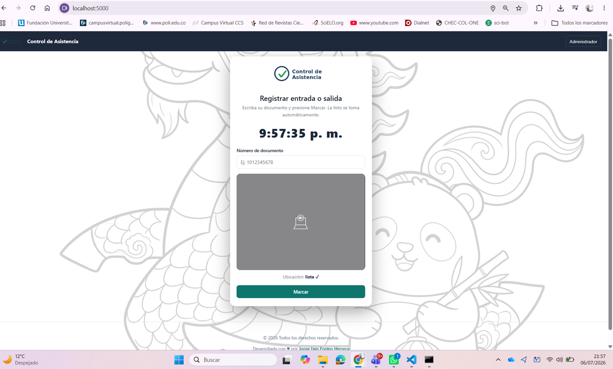
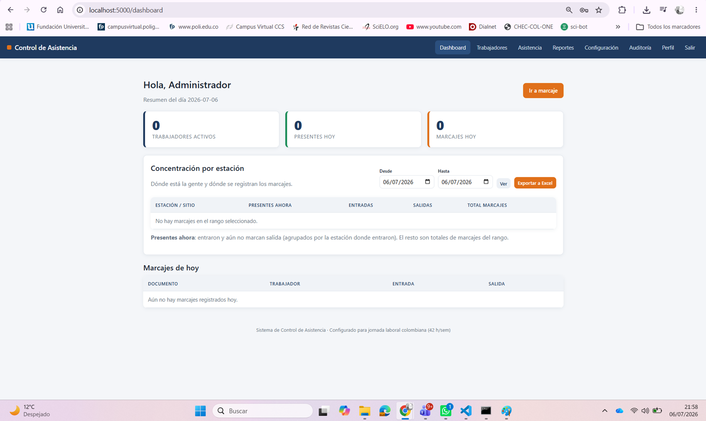
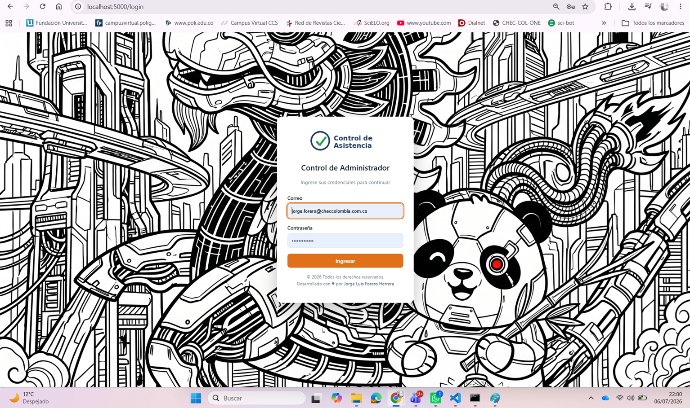

# Sistema de Control de Asistencia con Geocerca y Verificación Fotográfica

Aplicación web desarrollada en **Python/Flask** para el control de asistencia de personal en obra, con **kiosko público de marcación** que valida la ubicación GPS del trabajador contra múltiples geocercas (estaciones de obra) y captura fotografía automática en cada marcaje. Calcula horas extras y recargos según la **legislación laboral colombiana** (jornada de 42 h/sem — Ley 2101 de 2021, CST) y exporta reportes a Excel.

> Proyecto real desarrollado para el control de personal en un megaproyecto de infraestructura con 17 frentes de obra simultáneos.

---

## ✨ Funcionalidades principales

**Kiosko público de marcación (sin contraseña para el trabajador)**
- El trabajador ingresa su documento y presiona "Marcar": la foto se captura automáticamente desde la cámara del dispositivo.
- Validación de ubicación por **geocercas múltiples** (fórmula de Haversine): el sistema verifica que el trabajador esté dentro del radio de alguno de los sitios de obra activos e identifica en cuál marcó.
- Detección automática de entrada/salida según el estado de la jornada.
- Límite de peticiones por IP (anti-spam y anti-enumeración de documentos).

**Panel administrativo**
- Dashboard con indicadores del día y **tablero de concentración de personal por estación** (quién está dónde, en tiempo real).
- Gestión de trabajadores con carga masiva desde Excel (plantilla descargable, validación fila a fila con reporte de errores).
- Reportes de horas: clasificación automática de horas ordinarias, extras (sobre el tope semanal), nocturnas y dominicales/festivas, con estimación de valores según recargos parametrizables.
- Exportación a Excel con formato (openpyxl).
- **Todos los parámetros laborales son editables desde el panel** (horarios, recargos, valor hora, festivos, turnos, geocercas): cero cambios de código para ajustar reglas de negocio.
- Auditoría completa de acciones (usuario, acción, IP, fecha) y respaldos de base de datos con un clic.

**Seguridad**
- Protección CSRF en todos los formularios (Flask-WTF).
- Contraseñas con hash (Werkzeug), bloqueo temporal por intentos fallidos de login.
- Fotografías servidas solo a usuarios autenticados; sanitización de nombres de archivo contra path traversal.
- Cabeceras de seguridad (X-Frame-Options, nosniff, Referrer-Policy) y cookies HttpOnly/SameSite.

---

## 🛠️ Stack técnico

| Capa | Tecnología |
|---|---|
| Backend | Python 3, Flask 3 (application factory + blueprints) |
| Base de datos | SQLite (SQL parametrizado, migraciones idempotentes) |
| Frontend | HTML5 (Jinja2), CSS3, JavaScript vanilla (getUserMedia, Geolocation API) |
| Reportes | openpyxl |
| Seguridad | Flask-WTF (CSRF), Werkzeug (hashing) |
| Producción | Waitress (WSGI) |

**Arquitectura:** separación estricta de responsabilidades — las rutas (`routes/`) no contienen SQL, los modelos (`models/`) son la única capa de acceso a datos, la lógica de negocio vive en servicios (`services/`) y las plantillas no contienen CSS ni JS en línea.

```
├── app.py            # Application factory + registro de blueprints
├── config.py         # Configuración y parámetros laborales por defecto
├── routes/           # Vistas (auth, kiosko, trabajadores, asistencia, reportes, configuración, auditoría)
├── models/           # Capa de datos (SQL parametrizado)
├── services/         # Lógica de negocio (cálculo de horas, geolocalización, Excel, backups)
├── utils/            # Conexión BD, seguridad (decoradores), auditoría/logging
├── templates/        # Vistas Jinja2
└── static/           # CSS y JS separados por página
```

---

## 📸 Capturas de pantalla

| Kiosko de marcación | Dashboard | Reportes de horas |
|---|---|---|
|  |  |  |

---

## 🚀 Instalación

Requisitos: Python 3.10+

```bash
git clone https://github.com/jorge03148/control-asistencia-geocerca.git
cd control-asistencia-geocerca
python -m venv venv
venv\Scripts\activate        # Windows  (Linux/macOS: source venv/bin/activate)
pip install -r requirements.txt
python app.py
```

Abrir **http://localhost:5000**. La base de datos, carpetas y el usuario administrador inicial (`admin@empresa.com` / `admin123` — cambiarlo de inmediato) se crean solos en el primer arranque.

Para producción: `waitress-serve --host=0.0.0.0 --port=5000 app:app` detrás de HTTPS (la cámara y el GPS del navegador lo exigen).

---

## ⚖️ Contexto normativo

El cálculo de horas implementa la jornada laboral colombiana parametrizable: tope semanal (42 h — Ley 2101 de 2021), recargos de horas extras diurnas/nocturnas, recargo nocturno y dominical/festivo (CST y reforma laboral vigente). Los porcentajes se editan desde el panel de configuración para adaptarse a cambios normativos sin modificar código.

---

## 👤 Autor

**Jorge Luis Forero Herrera** — Coordinador HSEQ/SST · Psicólogo · Desarrollador
Especialista en integrar gestión de seguridad y salud en el trabajo con automatización y análisis de datos (Python, Power BI, SQL).

[LinkedIn](https://www.linkedin.com/in/TU_PERFIL) · Bogotá, Colombia
